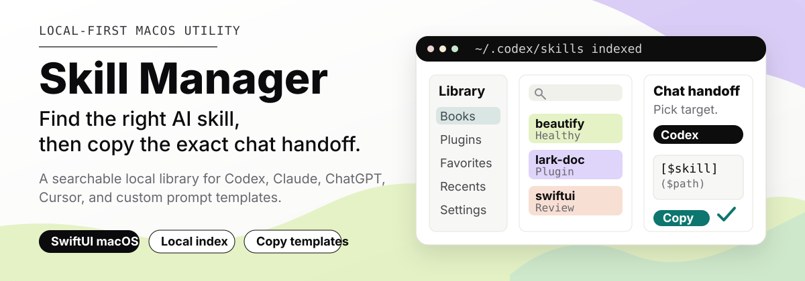
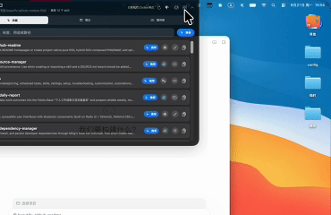
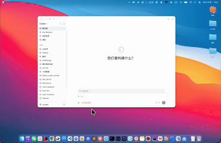
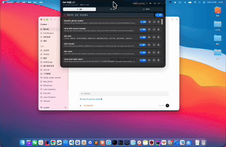
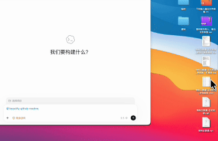

# Skill Manager

[English](./README.md) | 简体中文

<p align="center">
  
</p>

Skill Manager 是一个本地优先的 macOS 工具，面向在 Codex、Claude、ChatGPT、Cursor 以及插件工具链之间频繁使用可复用 AI Skill 的用户。它的核心亮点是刘海屏形式的工作区：把 Skill 查找、快速备忘、文件暂存区放在当前聊天和工作流附近，减少来回切换 Finder、编辑器和聊天窗口的成本。

## 主要功能演示

Skill Manager 围绕 AI 辅助工作中的四个小流程展开：找到合适的 Skill、复制正确的交接格式、记录临时上下文、把正在用的文件留在聊天附近。

| 聚焦 Skill 库 | 快速引用 Skill |
| --- | --- |
|  |  |
| 在同一个工作区搜索、筛选并查看本地、系统、项目和插件提供的 Skill。 | 为 Codex、Claude、ChatGPT、Cursor 或自定义模板复制合适的 mention 或 prompt。 |

| 便捷笔记 | 文件暂存 |
| --- | --- |
|  |  |
| 在当前聊天附近记录临时 Markdown 笔记，同时保留任务上下文。 | 将文件拖入短期暂存区域，让它们保持在聊天或下一步工作流附近。 |

## 它能做什么

- 打开刘海屏形式的工作区，用于 Skill 管理、快速记录备忘和拖拽友好的文件暂存。
- 索引本地 Codex Skill 根目录、系统 Skill、项目 Skill 和插件提供的 Skill。
- 提供聚焦的 Skill 库，支持搜索、来源标记、分类、健康状态、收藏和最近使用。
- 在详情页展示 Skill 描述、来源记录、标签、源路径、重复项信息和可读摘要。
- 复制面向不同平台的引用内容，包括 Codex Markdown mention、指令块、Claude prompt、ChatGPT prompt、Cursor prompt、纯文本和自定义模板。

## 为什么需要它

AI Skill 会越积越多，真实工作中还经常伴随临时笔记和短期文件。一个有用的 Skill 可能在 `~/.codex/skills`、`.system` 或插件缓存里，而不同聊天工具又需要不同的引用格式。Skill Manager 把这些上下文切换压缩成一个本地工作流：

```text
打开刘海屏工作区 -> 找到 Skill -> 记录上下文 -> 暂存文件 -> 复制交接内容
```

## 亮点功能

- **刘海屏形式的 Skill 管理：** 在当前任务旁快速打开 Skill 库，使用搜索、健康状态、分类、收藏、最近使用、插件视图和平台化复制动作。
- **快速记录备忘：** 阅读、编码或与 AI 对话时，在屏幕顶部附近写临时 Markdown 笔记。
- **文件暂存区：** 把文件拖入短期暂存区，在 Finder、代码和聊天之间移动时保持文件可见，再拖出或复制到下一步工作流。

## 核心工作流

1. 从菜单栏打开刘海屏工作区或 Skill Manager 主窗口。
2. 按名称、描述、标签、平台或源路径搜索。
3. 在任务需要本地上下文时，记录快速备忘或暂存相关文件。
4. 在 Skill 详情页检查使用场景、来源、健康状态和源码摘要。
5. 选择目标平台模板，复制生成的 mention 或 prompt，再粘贴到当前 AI 聊天中。

## 产品界面

| 区域 | 用途 |
| --- | --- |
| Library | 搜索和筛选所有已索引 Skill，包括本地、系统、项目和插件条目。 |
| Recommendations | 根据当前 Codex 会话上下文展示可能有用的 Skill。 |
| Plugins | 查看插件包及其贡献的 Skill。 |
| Favorites and Recents | 让常用工作流在复制后更容易再次访问。 |
| Settings | 管理根目录、重新索引、语言、开机启动和复制模板。 |
| Notch workspace | 将 Skill 搜索、快速备忘和文件暂存放在屏幕顶部附近。 |
| Quick notes | 不打开完整笔记应用，也能记录 Markdown 临时笔记。 |
| File shelf | 在 Finder、代码和聊天之间移动时临时保存文件。 |

## 复制模板

应用内置了常见聊天平台的模板：

```md
[$skill_name]($skill_path)
```

```text
Use the "$skill_name" skill for this task.
Skill path: $skill_path
When to use it: $description
```

模板保存在本地，可以编辑，也可以复制后创建新平台模板。不支持的来源类型会回退到通用 Markdown 或纯文本指令。

## 健康状态与来源记录

Skill Manager 会显示日常维护信息，但不会把自己变成完整编辑器。索引条目可以显示健康、缺少元数据、文件缺失、名称重复、不可读等状态。存在 `SOURCE.md` 时，应用会展示来源记录，帮助区分第三方 Skill、系统 Skill 和自己创建的 Skill。

## 致谢

Skill Manager 引用并改造了 [NotchNotes](https://github.com/oil-oil/NotchNotes) 中刘海屏工作区相关的部分实现。感谢 NotchNotes 项目提供的实现思路和开源工作。

## 配套 Skill

本仓库内置配套 Skill：[`$ming-skill-source-manager`](./skills/ming-skill-source-manager/SKILL.md)。使用它为已安装 Skill 创建和审计 `SOURCE.md` 来源记录，然后在 Skill Manager 里浏览结果、识别第三方或未知来源，并复制正确的 Skill 引用到聊天中。

典型配合方式：

```text
$ming-skill-source-manager 写入 SOURCE.md -> Skill Manager 索引来源记录 -> 聊天交接时复制正确 Skill 引用
```

配套 Skill 文件位于：

```text
skills/ming-skill-source-manager/
├── README.md
├── SKILL.md
├── SOURCE.md
└── scripts/manage_sources.py
```

## 安装

### 安装 macOS 应用

要求：

- macOS，并安装支持当前项目设置的 Xcode。
- SwiftUI 和 AppKit 运行环境。
- 本地包依赖 `Vendor/swift-markdown-engine`。

可以在 Xcode 中使用 `skillManger` scheme 运行，也可以在终端构建：

```bash
xcodebuild \
  -project skillManger.xcodeproj \
  -scheme skillManger \
  -destination 'platform=macOS' \
  build
```

创建本地 DMG：

```bash
./script/package_dmg.sh
```

### 安装配套 Skill

手动本地安装：

```bash
export CODEX_HOME="${CODEX_HOME:-$HOME/.codex}"
mkdir -p "$CODEX_HOME/skills/ming-skill-source-manager"
cp -R skills/ming-skill-source-manager/. "$CODEX_HOME/skills/ming-skill-source-manager/"
python3 "$CODEX_HOME/skills/ming-skill-source-manager/scripts/manage_sources.py" --help
```

安装后可在 Codex 中这样引用：

```md
[$ming-skill-source-manager](./skills/ming-skill-source-manager/SKILL.md)
```

如果仓库发布到 GitHub，也可以用 Codex 的 skill installer 按路径安装：

```bash
python3 ~/.codex/skills/.system/skill-installer/scripts/install-skill-from-github.py \
  --repo <owner>/<repo> \
  --path skills/ming-skill-source-manager
```

## 调试

### 应用检查

运行测试：

```bash
xcodebuild test \
  -project skillManger.xcodeproj \
  -scheme skillManger \
  -destination 'platform=macOS'
```

调试刘海屏工作区时，构建通过后建议手动检查：

- 从菜单栏展开和收起刘海屏工作区。
- 创建快速备忘，并确认切换焦点后内容仍保留。
- 把文件拖入文件暂存区，再拖出。
- 搜索一个已知 Skill，打开详情页，并复制 Codex mention。

### 配套 Skill 检查

验证辅助脚本：

```bash
python3 -m py_compile skills/ming-skill-source-manager/scripts/manage_sources.py
python3 skills/ming-skill-source-manager/scripts/manage_sources.py --help
```

只读审计，不写入文件：

```bash
python3 skills/ming-skill-source-manager/scripts/manage_sources.py audit --skills-root ~/.codex/skills
```

只有在明确要写入时，才补齐缺失的 `SOURCE.md`：

```bash
python3 skills/ming-skill-source-manager/scripts/manage_sources.py audit \
  --skills-root ~/.codex/skills \
  --include-system \
  --write \
  --write-unknown
```

只有在明确要联网搜索未知来源时，才启用 GitHub 搜索：

```bash
python3 skills/ming-skill-source-manager/scripts/manage_sources.py audit \
  --skills-root ~/.codex/skills \
  --include-system \
  --github-search-unknown
```

不要把 token、密钥或带凭据的 clone URL 写入 `SOURCE.md`。

## 项目说明

- Bundle identifier 是 `com.example.skillManger`。
- Xcode 项目里的产品名当前为 `skillManger`。
- MVP 范围聚焦本地 Skill 库管理和聊天交接，不包含 marketplace 发布或完整 `SKILL.md` 编辑器。
- 当前仓库尚未发布 license 文件。
